======================================================
KAMPALA EMERGENCY DIGITAL TRANSPORT SYSTEM
======================================================
AMBULANCE APPLICATION USER GUIDE
---------------------------------
|
|
|
|
|
|
|
|

Prepared by: Outbox (U) Ltd

|
|
|
|
|
|
|

TABLE OF CONTENTS
-----------------
INTRODUCTION
****************
| 1.1 About the Kampala Emergency Digital Transport System
| 1.2 About this user guide
|    1.2.1 Manual Users
| 1.3 System requirements
| 1.4 Understand the typography

2. GETTING STARTED
*******************
| 2.1 New user Login
| 2.2 Change password
| 2.3 Logout

3. EXPLORE SYSTEM FEATURES
***************************
| 3.1 Bottom Menu
|     Home
|     History
|     Account

4. GUIDING STEPS TO USE THIS APPLICATION
*****************************************
| 4.1 Accept an incoming Emergency dispatch
| 4.2 Decline an incoming Emergency
| 4.3 Go to pick up Location
| 4.4 Confirm at Scene
| 4.5 Pick up Patient
| 4.6 Drop off patient
| 4.7 Fill hand over Report

1. INTRODUCTION
*****************************************
1.1 About the Kampala Emergency Digital Transport System
############################################################
The Kampala Emergency Digital Transport system was developed as part of a three year grant for
the Kampala Slum Maternal and New-born Health (MaNe) project funded by USAID. The goal of the
MaNe project is to generate evidence on effective and feasible interventions to improve Maternal
and Newborn Health for the urban poor in Kampala. This 3-year USAID funded implementation
research effort is testing innovative approaches to address the demand and supply-side barriers
affecting care-seeking, effective referral and transport challenges and provision of quality care for
urban poor. From the statistics of the KCCA 24-hour emergency call and dispatch centre between
March and May 2020, up to 96% of the emergencies transported using the existing ambulance
system were maternal and newborn health emergencies. The primary beneficiaries of this system
are pregnant women and newborn babies although this system is designed to cater to all
emergency referrals. From its inception, this system was created to achieve the following
objectives;

- To map and connect all ambulances, public and private in Kampala, privately owned
  vehicles for referral and linkage purposes.
- To develop a functional triaging system that links patients in communities to 
  facilities and ambulances to enable patient transfer
- To capture data and generate reports for decision making in emergency maternal 
  referral services.

The Kampala Emergency Digital Transport system has different interfaces namely: Call Centre
interface, health facility interface and the ambulance application which all work concurrently. This
user guide will focus on the usage of the health facility interface.

1.2 About this user guide
###########################
This document will guide ambulance drivers and/or ambulance Emergency Medical Technicians
Technicians on how to use this application.

1.2.1 Manual Users
+++++++++++++++++++
| **Ambulance drivers**

The ambulance drivers will utilize this application to view all emergency dispatches sent to them
by the KCCA call centre. Additionally, the ambulance drivers will be able to update the call centre
as they transition to attend to a particular emergency dispatch assigned to them.

1.3 System requirements
###########################
Please ensure that your tablet meets the following minimum system requirements.

+--------------------------------------+
| Tablet                               | 
+======================================+
| Operating System: Android 7 and above| 
| west                                 |    
+--------------------------------------+
| RAM: 2GB and above                   |
+--------------------------------------+
| Storage: 32GB and above              | 
+--------------------------------------+
| Connection: 4G recommended           | 
+--------------------------------------+
| Form factor: Tablet                  | 
+--------------------------------------+

1.4 Understand the typography
##############################
This document contains the following typographic conventions which will assist you to easily
interpret the information in this manual.

| Italic text identifies new terms

| BOLD TEXT identifies a button or item that is clickable and or actionable.

| Note provides additional information about a given subject matter

2. GETTING STARTED
*****************************************
2.1 New user Login
############################################################
To use this application, you will need to **SIGN IN** using your registered phone number and password provided to you by the KCCA call centre.

- Insert your phone number and password and then the grey sign in button should turn to
  red.
- Click **SIGN IN**

.. image:: ./images/image1.png
    :width: 300px
    :align: center
    :height: 500px
    :alt: alternate text

.. image:: ./images/image3.png
    :width: 300px
    :align: center
    :height: 500px
    :alt: alternate text

2.2 Change password
############################################################
This will allow you to change your password.

- Click **ACCOUNT** on the bottom menu bar as seen in the image below

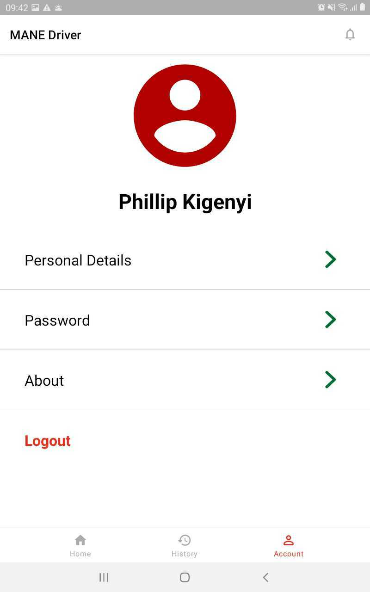

- Click **PASSWORD**
- Enter your current password and new password in the pop up below. Re enter your new 
  password for confirmation. 

.. image:: ./images/image4.png
    :width: 300px
    :align: center
    :height: 500px
    :alt: alternate text

- Then click SAVE PASSWORD to save your new password.

2.3 Logout 
############################################################
This will allow you to logout of the application.

- Click **ACCOUNT** on the  bottom menu bar as seen in the image below

- Click **LOGOUT**
- A message will be appear asking if you are sure you want to logout of the application.

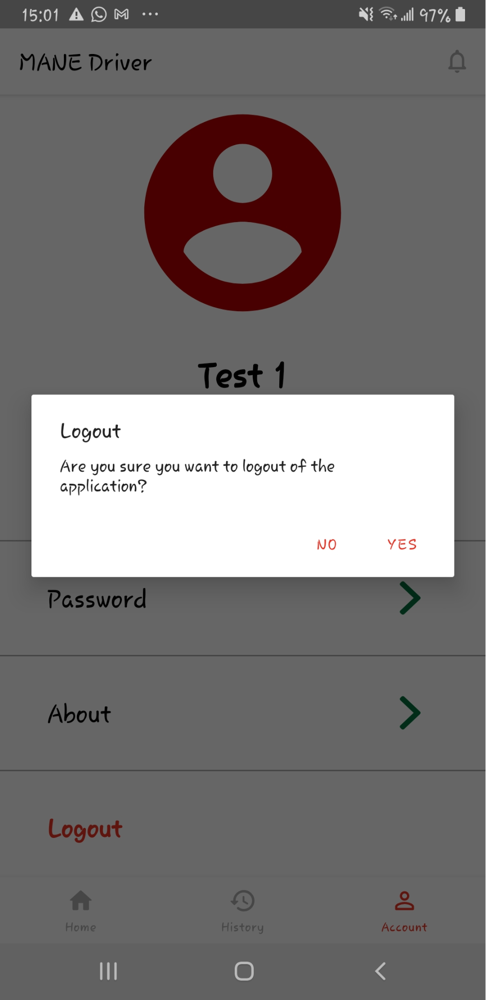

- Click **YES** to logout 

3. EXPLORE SYSTEM FEATURES
*****************************************
3.1 Bottom Menu
############################################################
| Home 

When you sign in, this home page is displayed. This page has a map showing your current location. 

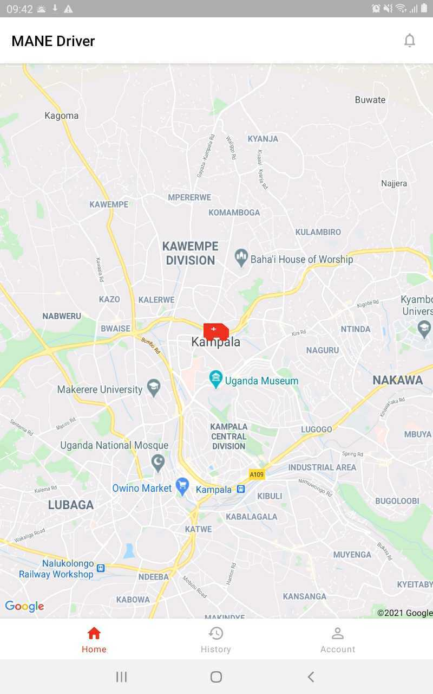

| History

This history tab shows you the ongoing and completed emergency requests handled by you.

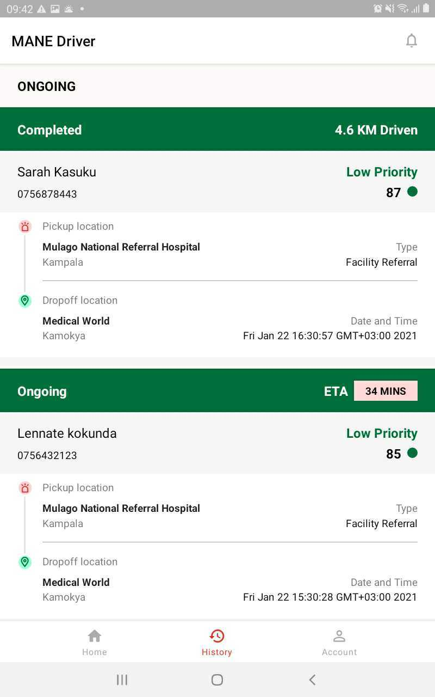

| Account

This account tab allows you to view your personal details, change your password, log out and information about the MaNe project. 

4. GUIDING STEPS TO USE THIS APPLICATION 
*****************************************
4.1 Accept an incoming Emergency dispatch
############################################################
#. You will receive an incoming emergency dispatch notification from the call centre 
   which will display as shown below. You will hear a sound ring when an incoming 
   emergency dispatch is sent to you.
#. Click **ACCEPT** to continue and handle this emergency   

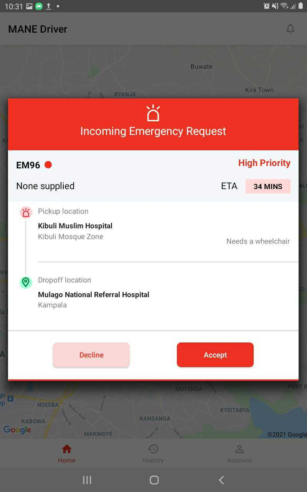

4.2 Decline an incoming Emergency 
############################################################
#. You have received an incoming emergency dispatch notification from the call centre 
   which will display as shown in 4.1
#. Click the **DECLINE**, you will be prompted to give reasons for declining this 
   dispatch. 
  

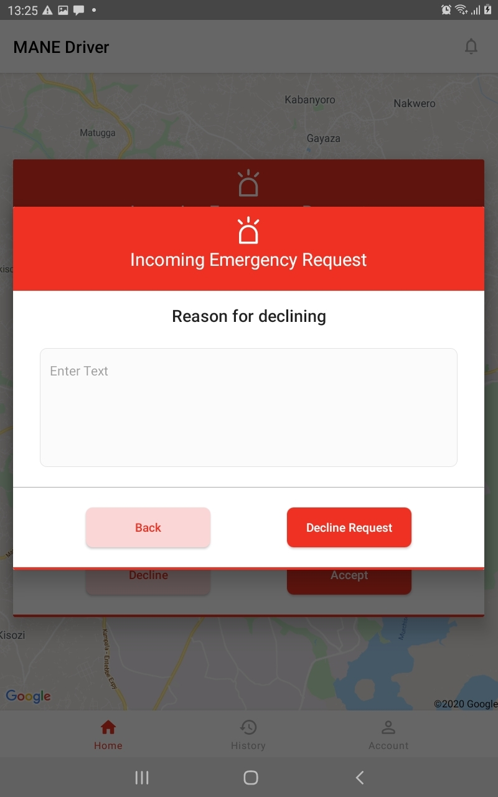

4.3 Go to pick up Location
############################################################
#. As you kick off to drive to the patient location

#. slide the **GO TO PICK UP LOCATION** button to be able to view directions to the pick 
   up 
   location

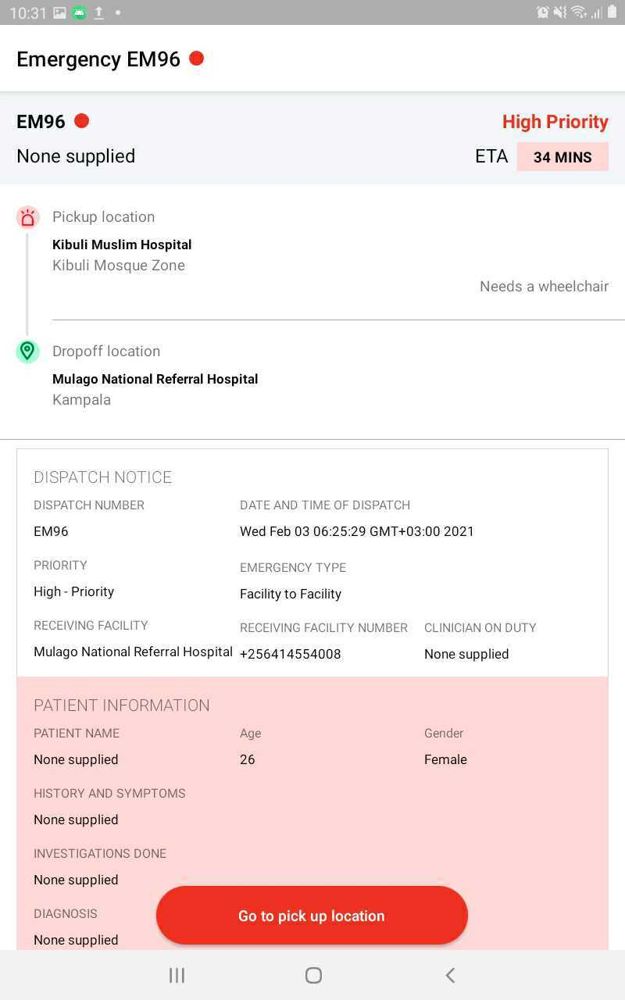

4.4 Confirm at Scene  
############################################################
#. When you arrive at the pick up location of the patient

#. Slide the **CONFIRM AT SCENE** button to indicate that you have arrived. 

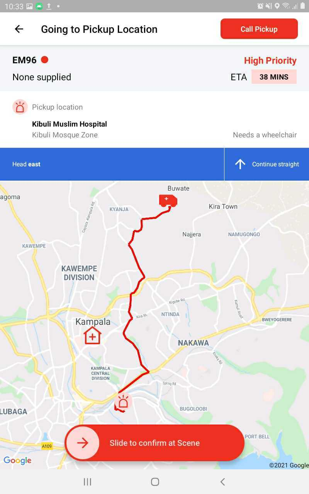

4.5 Pick up Patient
############################################################
#. After you have loaded the patient in the ambulance and you are proceeding to set off 
#. Slide the **PICK UP PATIENT** button. The map will display directions to the drop off 
   location of the patient. 

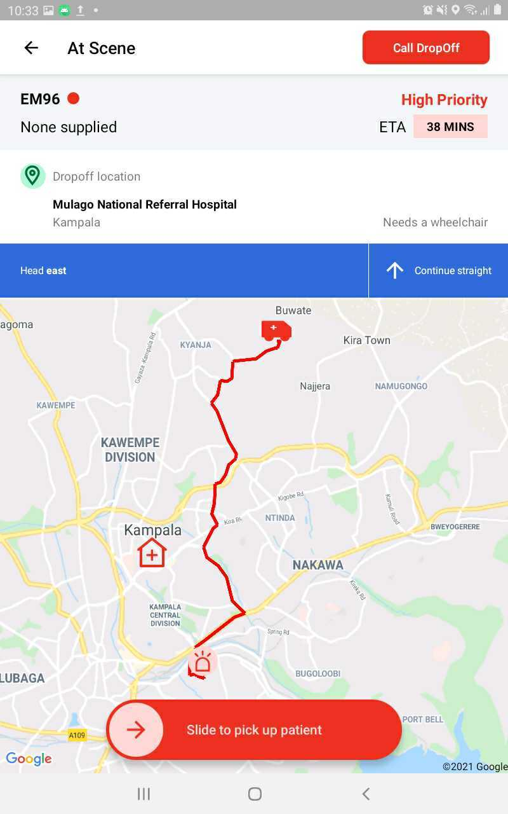

4.6 Drop off patient
############################################################
#. When you have arrived at the receiving facility 
#. Slide the **DROP OFF PATIENT** button to indicate that you have arrived at the 
   receiving facility.

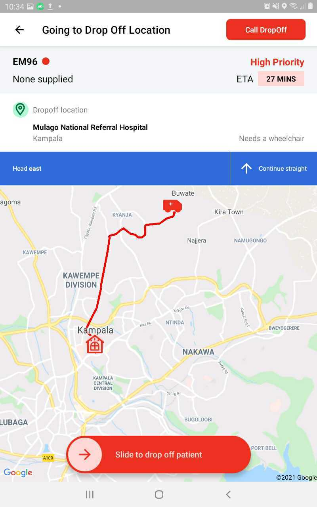

4.7 Fill hand over Report
############################################################
#. When you have arrived at the facility, you will be required to submit a hand over 
   report as shown below 

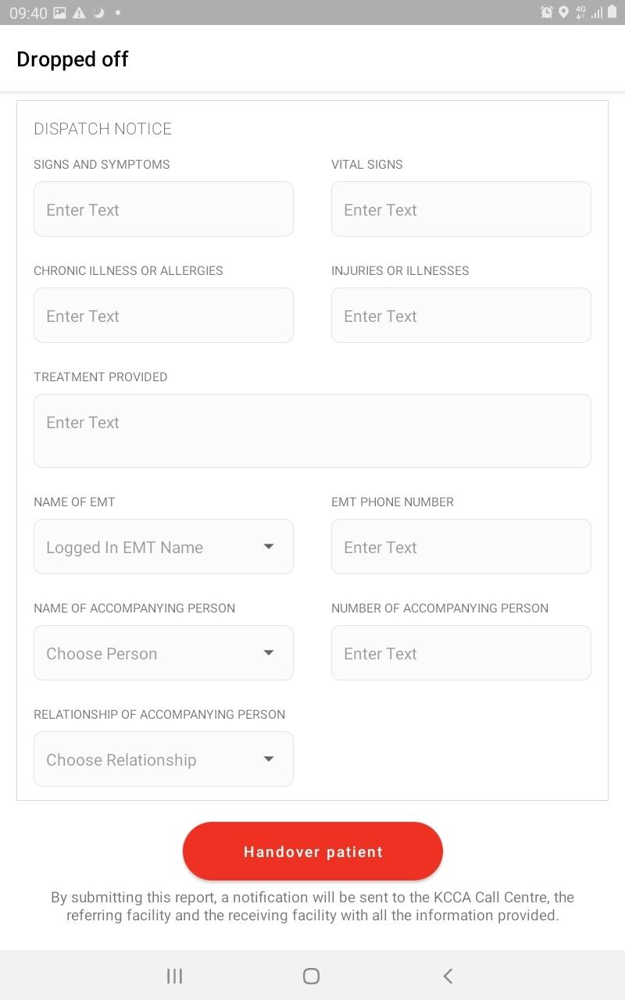