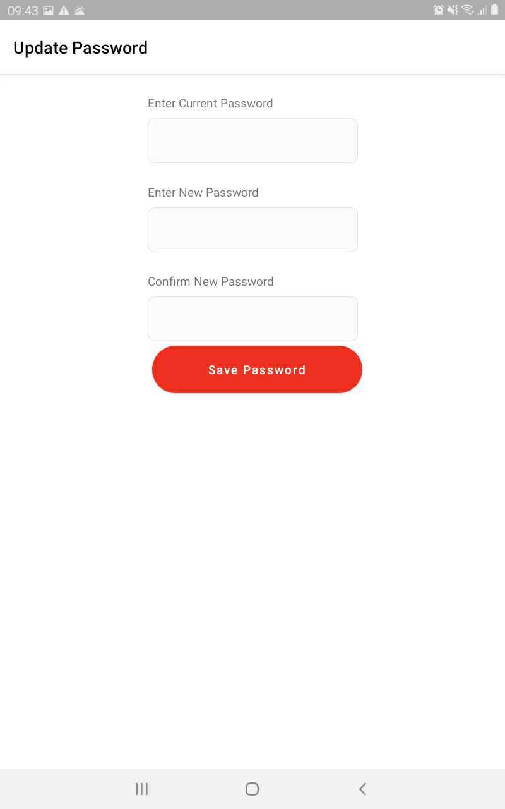

======================================================
KAMPALA EMERGENCY DIGITAL TRANSPORT SYSTEM
======================================================
KAMPALA AMBULANCES SERVICE APPLICATION USER GUIDE
-----------------------------------------------------
|
|
|
|
|
|
|
|

Prepared by: Outbox (U) Ltd

|
|
|
|
|
|
|

TABLE OF CONTENTS
-----------------
INTRODUCTION
****************
| 1.1 About the Kampala Emergency Digital Transport System
| 1.2 About this user guide
|     1.2.1 Manual Users
| 1.3 System requirements
| 1.4 Understand the typography

Getting Started
*******************
| 2.1 Downloading the app 
| 2.2 New user Login
| 2.3 Logout

3. EXPLORE SYSTEM FEATURES 
******************************************************
| 3.1 Side Bar Menu
|     Referrals
|     Facilities
|     Staff
|     Patients	
|     Settings	
|     Reports
| 3.2 Referral Icons
|     Incoming Referral
|     Outgoing Referral
| 3.3 Referral color codes
| 3.4 Referral Statuses

4. GUIDING STEPS TO USE SYSTEM (HOW TO’S)
******************************************************
| 3.1 Bottom Menu
|    3.1.1 Home
|    3.1.2 History
|    3.1.3 Account 
|          3.1.3.1 Personal Details

4. GUIDING STEPS TO USE THIS APPLICATION
******************************************************
| 4.1 Fill in medical profile
| 4.2 View public ambulances
| 4.3 Request an ambulance.
| 4.4 Cancel ambulance request 
| 4.5 Track Ambulance Request
|     4.5.1 Ambulance request timeline
|     4.5.2 Patient details
|     4.5.3 Emergency details 
|     4.5.4 Receiving facility details
|     4.5.5 Ambulance details
| 4.6 Share Feedback 

1. INTRODUCTION
*****************************************
1.1 About the Kampala Emergency Digital Transport System
############################################################
The Kampala Emergency Digital Transport system was developed as part of a three year grant for the Kampala Slum Maternal and New-born Health (MaNe) project funded by USAID. The goal of the MaNe project is to generate evidence on effective and feasible interventions to improve Maternal and Newborn Health for the urban poor in Kampala. This 3-year USAID funded implementation research effort is testing innovative approaches to address the demand and supply-side barriers affecting care-seeking, effective referral and transport challenges and provision of quality care for urban poor. From the statistics of the KCCA 24-hour emergency call and dispatch centre between March and May 2020, up to 96% of the emergencies transported using the existing ambulance system were maternal and newborn health emergencies. The primary beneficiaries of this system are pregnant women and newborn babies although this system is designed to cater to all emergency referrals. From its inception, this system was created to achieve the following objectives;

- To map and connect all ambulances, public and private in Kampala, privately owned 
  vehicles for referral and linkage purpose
- To develop a functional triaging system that links patients in communities to 
  facilities and ambulances to enable patient transfer
- To capture data and generate reports for decision making in emergency maternal 
  referral services

The Kampala Emergency Digital Transport system has different interfaces namely: Call Centre interface, health facility interface and the ambulance application which all work concurrently. This user guide will focus on the usage of the call centre interface.  

1.2 About this user guide 
###########################
This document will guide people in the community on how to use the Kampala Ambulance Services Application.

1.2.1 Manual Users
+++++++++++++++++++
**Community members**

The members in the community will use this application to order for an ambulance in case of an emergency that requires one. 

1.3 System requirements
###########################
Please ensure that your phone meets the following minimum system requirements. 

+--------------------------------------------------------------------------------+
| Phone                                                                          |
+================================================================================+
 Operating System: Android 7 and above                                           |
+--------------------------------------------------------------------------------+
|  RAM: 2GB and above                                                            | 
+--------------------------------------------------------------------------------+
| Connection: 3G                                                                 |
+--------------------------------------------------------------------------------+
| Form factor: Phone                                                             |
+--------------------------------------------------------------------------------+

1.4 Understand the typography
############################################################
This document contains the following typographic conventions which will assist you to easily interpret the information in this manual. 

| Italic text identifies new terms

| **BOLD TEXT**  identifies a button or item that is clickable  and or actionable.

| Note   provides additional information about a given subject matter

2. GETTING STARTED
*****************************************
2.1 Downloading the app 
############################################################

| On your phone, open the google play store app 

| On your device, open Google Play Store or visit the Google Play store on a web 
  browser.

#. 1. Search or browse for “Kampala Ambulance Services.” 

#.  Select Kampala Ambulance Services from the list. 

#.  Click Install.

#. When the app installs, click Open. 

2.2 New user Login
############################################################

| Once you have downloaded the application on your device you will need to create an 
  account by clicking **SIGN UP**(Create an account) and then **SIGN IN** using the 
  phone number you entered and an OTP code sent to the same number.

2.2.1 To Create an Account 
+++++++++++++++++++++++++++++

#. Click the **Sign Up** option in the right hand bottom corner. 

#. A Sign Up form will be displayed. 

#. Fill in all the Fields in the sign up form. Once all the fields have been filled in 
   the Grey Sign Up button should turn to Red.  

#. Click the red **SIGN UP** button.

#. You should see a notification that reads “Your Account was created successfully”

2.2.2 To Sign In
++++++++++++++++++++++

#. Enter your phone number in the **PHONE NUMBER** field on the Login screen. Once you 
   have filled in the number, the Grey Sign In button should turn to Red. 

#. Click the **SIGN IN** button.

#. Once you have Signed in, an OTP code will be sent to your messages app on your phone. 
   You should see a “Your OTP code has been sent” notification. 

#. Enter the OTP code sent on your phone number and Click **VERIFY**. 

#. You should see a “Login successful ”notification.

2.3 Logout
############################################################

This will allow you to logout of the application. 

#. To logout Click **ACCOUNT** on the bottom menu bar as seen in the image below 

#. Click **LOGOUT**

#. A message will be appear asking if you are sure you want to logout of the application 

#. Click LOGOUT to logout.

3. EXPLORE SYSTEM FEATURES
*****************************************
3.1 Menu
############################################################
Once you have signed in successfully, you will be able to view a menu. The menu is at the button of your screen and it has Home, History and Account as the items with corresponding icons as displayed below: 

3.1.1 Home
+++++++++++++++

The Home page is displayed by default. This page has a map showing your current location, has two tabs that allow you to change the view of the ambulances and the **REQUEST AMBULANCE** button.

3.1.2 History
+++++++++++++++++++++
The History page displays past events of your requests that are organised under the following categories: Ongoing, Completed and Cancelled. 
  
#. Ongoing: These are requests that are actively being worked on. 

#. Completed: These are requests that have been completed. 

#.Cancelled: This shows a list of requests that have been cancelled.

3.1.3 Account
++++++++++++++++++++++
The Account page allows you to view your personal details, log out and view information about the MaNe project.

3.1.3.1 Personal Details
+++++++++++++++++++++++++++++++
This allows you to view and edit your personal details in the application.

3.1.3.2 About 
++++++++++++++++++++++++
This displays information about the Project.

3.1.3.3 Logout
+++++++++++++++++++++++++++++
Refer to section **2.3** above.

4. GUIDING STEPS TO USE THIS APPLICATION 
********************************************
4.1 Fill in medical profile
######################################

#. A form that captures your medical profile is displayed every time you login into the 
   Kampala Ambulance Services application. 

#. Fill in the medical profile form fields. 

#. Click the **SAVE** button. You should be able to view a “Your profile has been 
   updated” notification. 

#. If you do not wish to fill in the medical profile then Scroll down and click **SKIP 
   FOR NOW**.

4.2 View Ambulances
#################################

There are two ways for you to view ambulances within the application: The Map View and the List View. 

4.2.1 Map View: 
+++++++++++++++++++++++
This is the default view of the ambulances in the application. 

#. Click the **MAP** button.You can see both the public and private ambulances displayed 
   at the bottom of the screen and arranged horizontally.

#. Scroll to the right and left to see all the ambulances on the platform. 

#. Select a given ambulance to view more details about it. 

4.2.2 List View: 
+++++++++++++++++++++++
To view ambulances using the List view,

#. Click the **LIST** button. This view lets you see a list of public and private 
   ambulances arranged vertically. 

#. Scroll down and up to see the complete list of ambulances on the platform. 

#. Select a given ambulance in order to view more details about it.

4.3 Request an Ambulance. 
################################
#. Once you have viewed the list of ambulances, 

#. Select an ambulance of your preference from the list by clicking the **heart** Icon 
   on the right of the ambulance name selected to indicate that it's the one you prefer.

#. Click the **REQUEST AMBULANCE NOW** button. 

#. You will see a pop up notification saying “Your request has been made.” 5. Another 
   pop-up screen will appear showing a countdown for you to receive feedback from the 
   call center. 

#. You can proceed to select what the emergency is about by clicking on the icons below 
   “**COVID -19**”,“ **Pregnancy/Newborn**”“**Accident**” or “**Other**.” 

#. Clicking any of the Emergency categories will display a pop up message saying 
   “Emergency updated” This updates your diagnosis at the call centre in real time.

4.4 Cancel ambulance request 
#########################################

#. To cancel your ongoing ambulance request, Click the white **CANCEL REQUEST** button. 

#. Click the **CANCEL REQUEST** button. 

#. A pop up will appear that has reasons for cancelling the request. 

#. Select the appropriate reason from the displayed options. The radio button should 
   turn red to indicate the selected reason. 

#. Click the **CANCEL REQUEST** button.

4.5 Track Ambulance Request 
###########################################

| To track an ambulance that has been dispatched, Click “ Track” in the right upper 
  corner of “Request Ambulance Screen”. 

| A page with different categories of Your Request Details will be displayed as shown 
  below 

4.5.1 Ambulance request timeline
++++++++++++++++++++++++++++++++++++++++++
This shows the different timelines of the ambulance from the time the request was made up to when the patient is received at the facility.

4.5.2 Patient details 
++++++++++++++++++++++++++++++++++++++
This shows details about the patient such as the name, age, gender and phone number.

4.5.3 Emergency details 
++++++++++++++++++++++++++++++++++++++
This shows the details of the emergency including the emergency diagnosis that is being handled. E.g, Covid 19

4.5.4 Receiving facility details
++++++++++++++++++++++++++++++++++++++
This shows the details of the facility that is going to receive the patient being handled in the emergency including the Facility Name, Facility Number, Location and the Clinician incharge.

4.5.5 Ambulance details 
++++++++++++++++++++++++++++++++
This contains the details of the ambulance that has handled the emergency.

4.6 Share Feedback 
############################

#. To share your feedback. Go to the Track option as described above. 

#.  You should be able to view the **Share Feedback** button just below the Ambulances 
    Details.

#. Click the “**Share Feedback**” option. 

#. **Tap** the stars to rate the different questions displayed by that match your 
   experience 

#. Click the **SUBMIT** button.

   (One being so poor and Five being extremely good). 