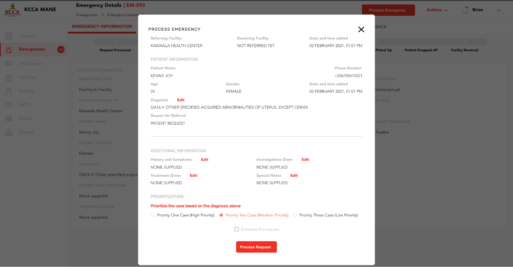

======================================================
KAMPALA EMERGENCY DIGITAL TRANSPORT SYSTEM
======================================================
USER GUIDE
---------------------------------
|
|
|
|
|
|
|
|

Prepared by: Outbox (U) Ltd

|
|
|
|
|
|
|

TABLE OF CONTENTS
-----------------
Introduction
****************
| 1.1 About the Kampala Emergency Digital Transport System
| 1.2 About this user guide
|     1.2.1 Manual Users
| 1.3  System requirements

Getting Started
*******************
| 2.1 New Users
| 2.2 System Features
|     2.2.1 Overview
|           2.2.1.1 Map View
|           2.2.1.2 Dashboard
|     2.2.2 Emergencies	
|     2.2.3 Ambulances
|           2.2.3.1 Ambulance Filters
|     2.2.4 Facilities
|           2.2.4.1  Health Facility Filters
|     2.2.5 Staff
|     2.2.6 Patients
|     2.2.7 EMT’s
|     2.2.8 Drivers
|     2.2.9 Users
|     2.2.10 Settings
|     2.2.11 Reports

3. GUIDING STEPS TO USE SYSTEM (HOW TO’S)	
******************************************************
| 3.1 Call Centre Agent
|     3.1.1 How to Create an emergency
|     3.1.1 How to Create an emergency
|     3.1.3 How to Refer to a Health facility	
|     3.1.4 How to Assign an ambulance
|     3.1.5 How to Track an Ambulance
| 3.2 Call Centre Supervisor
|     3.2.1 To Create / Add a user
|     3.2.2 To Create / Add a Facility
|     3.2.2 To Create / Add an Ambulance
|     3.2.2 To Create / Add a Driver
|     3.2.2 To Create / Add an EMT	

1. INTRODUCTION
*****************************************
1.1 About the Kampala Emergency Digital Transport System
############################################################
The Kampala Emergency Digital Transport system was developed as part of a three year grant for the Kampala Slum Maternal and New-born Health (MaNe) project funded by USAID. The goal of the MaNe project is to generate evidence on effective and feasible interventions to improve Maternal and Newborn Health for the urban poor in Kampala. This 3-year USAID funded implementation research effort is testing innovative approaches to address the demand and supply-side barriers affecting care-seeking, effective referral and transport challenges and provision of quality care for urban poor. From the statistics of the KCCA 24-hour emergency call and dispatch centre between March and May 2020, up to 96% of the emergencies transported using the existing ambulance system were maternal and newborn health emergencies. The primary beneficiaries of this system are pregnant women and newborn babies although this system is designed to cater to all emergency referrals. From its inception, this system was created to achieve the following objectives;

- To map and connect all ambulances, public and private in Kampala, privately owned 
  vehicles for referral and linkage purpose
- To develop a functional triaging system that links patients in communities to 
  facilities and ambulances to enable patient transfer
- To capture data and generate reports for decision making in emergency maternal 
  referral services

The Kampala Emergency Digital Transport system has different interfaces namely: Call Centre interface, health facility interface and the ambulance application which all work concurrently. This user guide will focus on the usage of the call centre interface.  

1.2 About this user guide
###########################
This is a technical document intended to give assistance to  the users of the Kampala Emergency Digital Transport that include a Call Centre Agent, a Call Centre Supervisor and a Super Administrator of the system on how to navigate the call centre interface

1.2.1 Manual Users
+++++++++++++++++++

This section describes the persons/people who will utilize the  call centre interface of the Kampala Emergency Digital Transport system

#. **Call Centre Agent** - This is a person who manages emergency requests, inquiries 
   and sometimes complaints
#. **Call Centre Supervisor** - This is a person who is responsible for overseeing the 
   call centre teamwork, managing the team’s schedule, evaluating performance and 
   providing feedback, helping to resolve issues and disputes at the call centre and 
   reporting to senior management.

#. **Super Administrator** - The super administrator is typically an IT role  
   responsible for managing system artefacts such as creating  new users at the health 
   facilities and call the call centre, accounts for ambulance drivers, managing the 
   access and level of responsibility of the users and editing and updating user 
   information. 

1.3  System requirements 
###########################
Please ensure that your computer or tablet meets the following minimum system requirements.

+----------------------------------------+---------------------------------------+
| Computer                               | Tablet                                |
+========================================+=======================================+
| Operating System: Windows 7 and Above  | Operating System: Android 7 and above |
+----------------------------------------+---------------------------------------+
| RAM: 8GB and above                     |    RAM: 2GB and above                 | 
+----------------------------------------+---------------------------------------+
| Browser: Google Chrome version 85 and  |     Storage: 32GB and above           |
| above or Firefox version 85 and above  |                                       |
|                                        |                                       |
+----------------------------------------+---------------------------------------+
| Connection: Stable internet connection |    Connection: 4G recommended         |
| through wifi or cable                  |                                       |
|                                        |                                       |
+----------------------------------------+---------------------------------------+
|                                        |     Form factor: Tablet               |
+----------------------------------------+---------------------------------------+

2. GETTING STARTED
*****************************************
2.1 New Users
############################################################
This is a person using the system for the first time. This person may be a Call Centre Agent or a Call Centre Supervisor. The accounts for first time users are created by the Super Administrator

| To use the system you need to log in.

#. As a new user go to https://ambulances.kcca.go.ug/. You should be able to see a page 
   where you can log in. There are two fields that require input before you can access 
   the interface:

   A. **Email Address**: This is where you can put your email address that was used to 
      create your account.
   B. **Password**: This is where you input your password.

    
    :align: center
    
    :alt: alternate text

#. Once you have filled in these fields then the grey sign in button should turn to red. 
   Click the red Sign In button to access the call center interface

2.2 System Features
############################################################
2.2.1 Overview
++++++++++++++++++
This provides a summary of the emergency information and ambulance information in the system. The Map view shows a map with active ambulances by default, while the dashboard tab has a breakdown of common key performance indicators  tracked in the system for quick decision making.

    
    :align: center
    
    :alt: alternate text

2.2.1.1 Map View
+++++++++++++++++
This is the default view that is displayed when you login successfully. The map view allows you to view ambulances within the Kampala Metropolitan area on a map.

    
    :align: center
    
    :alt: alternate text

When you click the ambulance icon you are able to see the ambulance’s corresponding details that include:

#. The ambulance type
#. The ownership of the ambulance
#. The driver’s name
#. The ambulance’s licence plate
#. The availability status of the ambulance

2.2.1.2 Dashboard
++++++++++++++++++

    
    :align: center
    
    :alt: alternate text

    
    :align: center
    
    :alt: alternate text

The Dashboard has 3 subsections that include Emergencies, Ambulances and Facilities.

#. Emergencies 
    Under this subsection, there are metric cards and graphs that show various 
    indicators.

    The metric cards include the following:

    A. **Total Emergencies**: This shows the total number of all emergencies that have 
       been logged at the call centre.

       .. image:: ./assets/callCenterUserGuideImages/image36.png
           
           :align: center
           
           :alt: alternate text

    B. **High Priority**: This shows the percentage and corresponding number of 
       emergency cases that are highly urgent and require immediate ambulance response. 
       These cases are color-coded red. 

       .. image:: ./assets/callCenterUserGuideImages/image35.png
           
           :align: center
           
           :alt: alternate text

    C. **Medium Priority**: This shows the percentage and corresponding number of 
       emergency cases that are urgent but not life threatening and may not require 
       immediate ambulance response. These cases are color-coded yellow. 

       .. image:: ./assets/callCenterUserGuideImages/image38.png
           
           :align: center
           
           :alt: alternate text

    D. **Low priority**: This shows the percentage and corresponding number of emergency 
       requests that are not urgent and the timeliness of the ambulance response may not 
       be necessary. These cases are color-coded green.

       .. image:: ./assets/callCenterUserGuideImages/image37.png
           
           :align: center
           
           :alt: alternate text

    E. **Unprocessed**:  This shows the percentage and corresponding number of calls 
       that have been logged at the call centre but have been not  attended to by the 
       call centre agent.

       .. image:: ./assets/callCenterUserGuideImages/image41.png
           
           :align: center
           
           :alt: alternate text

    F. **Informal Sector**:  This shows the percentage and corresponding number of calls 
       that were logged  at the call centre and originated from the informal sector.

       .. image:: ./assets/callCenterUserGuideImages/image39.png
           
           :align: center
           
           :alt: alternate text

The graphs include the following:

#. **Pie Charts**

     a) **Emergency Status** : This pie chart shows the number of calls that are 
        categorised according to the status in  processing by the call centre agents. 
        The status includes Unprocessed, Pending and Completed and details can be seen 
        if:

            i)   Unprocessed: These are calls that have been logged at the call centre 
                 but have not attended to yet by the call centre agent.

            ii)  Pending: These are calls that have been attended to by the call centre 
                 agents but have not been completed pending 

            iii) Completed: These are calls that have been attended to by the call 
                 centre agent and the referral loop has been completed up to patient 
                 drop off at the receiving health facility.

                 .. image:: ./assets/callCenterUserGuideImages/image40.png
                     
                     :align: center
                     
                     :alt: alternate text

     b) **Emergency Origin**:  This pie chart shows the number of calls categorized 
        according to  their point of origin. There are two points of origin: Facility- 
        Facility Calls and Community Calls and details can be seen when you hover over 
        the pie chart.

            i)   Facility to Facility call: These are calls that have been made from a 
                 health facility requesting to transfer a patient to another health 
                 facility. These  are represented by the **Red** color 

            ii)  Community calls: These are calls that have been made from the community 
                 by community dwellers requesting to be evacuated to a health facility. 
                 These are represented by the **Green** Color.

                 .. image:: ./assets/callCenterUserGuideImages/image42.png
                     
                     :align: center
                     
                     :alt: alternate text

#. **Bar Graphs**

     a) **Calls Per Division** : This bar graph shows the number of calls that have been 
        logged at the call centre categorized according to the divisions from which they 
        originated.

         .. image:: ./assets/callCenterUserGuideImages/image43.png
             
             :align: center
             
             :alt: alternate text

     b) **Requests from formal and informal settlements within Kampala** : This bar 
        graph shows the calls received categorized according to whether they originated 
        from either formal settlement or informal settlements within Kampala.

         .. image:: ./assets/callCenterUserGuideImages/image44.png
             
             :align: center
             
             :alt: alternate text

 II. **Ambulances**

         A. **Total Ambulances**: this shows the number of total ambulances that are 
            registered in the system.

         B. **Available**: This shows the number of ambulances that are accessible and 
            available for emergency response.

2.2.2 Emergencies
++++++++++++++++++

The emergencies tab lets you view information about the emergency response requests and the corresponding information such as the patient details, the referring facility, the receiving facility and provides ability to track the progress of the referral path.

.. image:: ./assets/callCenterUserGuideImages/image45.png
    
    :align: center
    
    :alt: alternate text

2.2.3 Ambulances
++++++++++++++++++

This tab lets you view the ambulances that are in the system and their corresponding ambulance details such as registration number, type of the ambulance, operational status, availability status, the ownership of the ambulance, the types of ownership and the attached drivers of the ambulances. To view any further information, click **View**.

    
    :align: center
    
    :alt: alternate text

2.2.3.1 Ambulance Filters
++++++++++++++++++++++++++++

The filters help you sort out the ambulances according to what you need based on availability, ownership and type of ambulance.

   I. **Availability**: This filter  lets you view the ambulances that are available or 
      unavailable.

          A. To select your choice click the radio button. The button should turn red 
             then click **FILTER**

          B. To go back click cancel.

          C. To remove any filters, select no filters.

   II. **Ownership**: This filter lets you view the ownership of the ambulances; whether 
       they are public or private for profit or private not for profit and the number of 
       ambulances under the each category:

          A. To select your choice, click the radio button. The button should turn red 
             then click **FILTER**

          B. To go back cancel.

          C. To remove any filters select no filters.

.. image:: ./assets/callCenterUserGuideImages/image47.png
    
    :align: center
    
    :alt: alternate text

2.2.4 Facilities
++++++++++++++++++
This tab lets you view a list of facilities that are under the system and their respective information such as facility name, facility health care level, the contact of the facility, the physical address, the name of the facility incharge and  operating hours To view further information, click on **View**

    
    :align: center
    
    :alt: alternate text

2.2.4.1  Health Facility Filters
++++++++++++++++++++++++++++++++++
The filters let you select the levels  of health care and type of ownership of the health facility

- To select your choice, click the radio button.  The button should turn red, then click 
  **Filter**.
- To remove all filters select no filters.
- To go back click cancel.

    
    :align: center
    
    :alt: alternate text

2.2.5 Staff
++++++++++++++++++
This tab lets you view the staff at the call centre with their corresponding information that includes, name, phone contact number and their designation level.

    
    :align: center
    
    :alt: alternate text

2.2.6 Patients
++++++++++++++++++
This tab lets you view the patients that have been managed through the system at the call centre and the respective patient details such as the patient names, the date of first visit, the patient gender, age, contact and the facility where the patient is registered. To view further information, click **View**.

    
    :align: center
    
    :alt: alternate text

2.2.7 EMT’s
++++++++++++++++++
This tab lets you view the Emergency Technicians(EMT) that are registered under the system and their respective details such as Name of the EMT, the phone contact of the EMT, the facility they are attached to and the availability status of the EMT. To view further information, click on **View**.

    
    :align: center
    
    :alt: alternate text

2.2.8 Drivers
++++++++++++++++++
This tab has the drivers of the ambulances and their respective information such as the Driver name, the Gender of the driver, the phone contact, the ambulances they are attached to, the facilities they are affiliated with and their availability status. To view any further information, Click on **View**.

    
    :align: center
    
    :alt: alternate text

2.2.9 Users
++++++++++++++++++
This tab has all the users of the system and user information such as the name of the user, the gender, phone contact, email address, their role in the system and their status.   The users include call centre agents, health facility workers and Administrators. To view any further information, Click on the **View**.

    
    :align: center
    
    :alt: alternate text

2.2.10 Settings
++++++++++++++++++
This is a section of the system that enables the system administrator to make changes to the various system component users. This tab enables the administrator to add new users, edit and update existing user information

    
    :align: center
    
    :alt: alternate text

2.2.11 Reports
++++++++++++++++++
This tab shows a tabular summary of the system progress and performance of the system that will enable appropriate analysis and practical recommendations. The report section enables the user to view key performance indicators of the system.    

| **2.2.11.a**

    
    :align: center
    
    :alt: alternate text

| **2.2.11.b**

    
    :align: center
    
    :alt: alternate text

3. GUIDING STEPS TO USE SYSTEM (HOW TO’S)
********************************************
3.1 Call Centre Agent
############################################################
3.1.1 How to Create an emergency
++++++++++++++++++++++++++++++++++++
   I. the **Create Emergency** button. You will be able to view a pop-up with two 
      emergency call origin categories i.e, Community Call and Interfacility-Referral 
      Call

      .. image:: ./assets/callCenterUserGuideImages/image29.png
          
          :align: center
          
          :alt: alternate text

   II. For a **Community Call**, Select  Community Call.  You should be able to view a 
       form where you can record patient information

   III. For an **Inter-Facility Referral Call**, Select Inter-facility Referral Call. 
        You should be able to view a form where you can record referral information
    
3.1.2 How to Process an emergency
++++++++++++++++++++++++++++++++++++

   I. From the emergencies view, select the emergency you want to process and click on 
      its action button.

   II. To process an emergency, click on the **Process Emergency** button.

   III. You will be able to view a form with emergency information. This is where you 
        triage the call using the information available in the form and update / change 
        it accordingly. Once all information has been entered, the **Process Emergency** 
        button will turn red. Click this button to process the call.

Note: Processing an emergency involves verifying the information you have received and categorizing the call into Priority Case levels according to the diagnosis provided. See section 2.2.1.2 Above

    
    :align: center
    
    :alt: alternate text

3.1.3 How to Refer to a Health facility
+++++++++++++++++++++++++++++++++++++++++++

   I. From the emergencies view, select the emergency you want to refer to a facility. 
      You can only refer to a receiving facility after processing the emergency from the 
      step above. 

   II. Once the emergency has been processed, click on the **Refer Receiving Facility** 
       action button.

   III. A popup will be presented and you should be able to view a list of health 
        facilities that you can refer to.

        .. image:: ./assets/callCenterUserGuideImages/image11.png
             
             :align: center
             
             :alt: alternate text

   IV. Once you have selected the facility, Click **Refer**. The emergency will now be 
       referred to the selected facility.

3.1.4 How to Assign an ambulance
++++++++++++++++++++++++++++++++++++

   I. From the emergencies view, select the emergency you want to dispatch an ambulance 
      for. You can only dispatch an ambulance after a receiving facility has been 
      identified and attached in the step above.

   II. Once the emergency has been referred to a receiving facility, click on the 
       **Assign Ambulance** action button.

   III. A popup will be presented and you should be able to view a list of available 
        ambulance drivers as well as their operational statuses you can send the 
        emergency dispatch to.

   IV. Click **Assign** once you have identified an ambulance to transport the patient.

    
    :align: center
    
    :alt: alternate text

3.1.5 How to Track an Ambulance
++++++++++++++++++++++++++++++++++++
   I. To be able to track an ambulance you should have been able to select an emergency 
      case, processed it and assigned and dispatched an ambulance successfully as 
      described above. 

   II. To track the ambulance that has been dispatched, Click Track Ambulance. You 
       should be able to view a map showing the location of the ambulance.

    
    :align: center
    
    :alt: alternate text

3.2 Call Centre Supervisor
############################################################
3.2.1 How To Create / Add a user
+++++++++++++++++++++++++++++++++
   I. Log in as a **Call Center Supervisor**.

   II. Click **Settings**

   III. You will be directed to the Users tab.

   IV. Click **Add User**, You should be able to view a form where you can input the 
       user details. 

   V. Once all user details have been input, the **Add User** button will turn red. 
       Click **Add User** to add the user.

    
    :align: center
    
    :alt: alternate text

    
    :align: center
    
    :alt: alternate text

3.2.2 How To Create / Add a Facility
++++++++++++++++++++++++++++++++++++++++++++++
   I. Log in as a **Call Center Supervisor**.

   II. Click **Settings**

   III. Select the Facilities tab.

   IV. Click **Add Facility**, You should be able to view a form where you can input the 
       Facility details. 

   V. Once all facility details have been input, the **Add Facility** button will turn 
      red. Click **Add Facility** to add the Facility.

.. image:: ./assets/callCenterUserGuideImages/image16.png
    
    :align: center
    
    :alt: alternate text

    
    :align: center
    
    :alt: alternate text

3.2.3 How  To Create / Add an Ambulance
++++++++++++++++++++++++++++++++++++++++++++++
   I. Log in as a **Call Center Supervisor**.

   II. Click **Settings**

   III. Select the Ambulances tab.

   IV. Click **Add Ambulance**, You should be able to view a form where you can input 
       the Ambulance details. 

   V. Once all ambulance details have been input, the **Add Ambulance** button will turn 
      red. Click **Add Ambulance** to add the Ambulance.

    
    :align: center
    
    :alt: alternate text

    
    :align: center
    
    :alt: alternate text

3.2.4 How To Create / Add a Driver
++++++++++++++++++++++++++++++++++++++++++++++
   I. Log in as a **Call Center Supervisor**.

   II. Click **Settings**

   III. Select the Drivers tab.

   IV. Click **Add Driver**, You should be able to view a form where you can input the 
       Driver details. 

   V. Once all driver details have been input, the **Add Driver** button will turn red. 
      Click **Add Driver** to add the Driver.

    
    :align: center
    
    :alt: alternate text

    
    :align: center
    
    :alt: alternate text

3.2.5 How To Create / Add an EMT
++++++++++++++++++++++++++++++++++++++++++++++
   I. Log in as a **Call Center Supervisor**.

   II. Click **Settings**

   III. Select the Drivers tab.

   IV. Click **Add Driver**, You should be able to view a form where you can input the 
       Driver details. 

   V. Once all driver details have been input, the **Add Driver** button will turn red. 
      Click **Add Driver** to add the Driver.

    
    :align: center
    
    :alt: alternate text

    
    :align: center
    
    :alt: alternate text

3.2.6 How To Export a Report
++++++++++++++++++++++++++++++++++++++++++++++

3.3 Super Administrator
##########################
To create or add users to the system as a super administrator,

   I. Log in as a Super Administrator.

   II. Click **Settings**

   III. Click on the users that you want to add.

Note: This user role is similar to the Call Centre User role. Please refer to section 3.2 Above.

4. TROUBLESHOOTING
**************************
4.1 Issues with Signing  In
######################################
4.1.1  I forgot my password.
+++++++++++++++++++++++++++++++++
In case you forget your password, Click Forgot Password?  on the login page. This should redirect you to a view where you can change your password.

| If you are still unable to change your password, contact your super administrator or supervisor.

    
    :align: center
    
    :alt: alternate text

4.1.2 I am unable to Sign In
+++++++++++++++++++++++++++++++++
#. Incase you are unable to login into the interface, Check to see if:

   I. The email address entered is correct. This is the email address that was used when 
      creating your account.

   II. Check to see if the password entered is correct. This is the password that was 
       created for you or the password that you have changed to.

   III. If all the above is correct, Click **Sign In**

- In case you are still unable to sign in when your email address and password are 
  correct

   I. Check to see if your internet connection is on. 
   II. If you are not connected to the internet, connect and try signing in.

   III. If you are connected and you are unable to sign in, refresh the page and sign 
        in. To refresh the page click on the refresh icon in the top left hand of your 
        browser.
        
        .. image:: ./assets/callCenterUserGuideImages/image5.png
            
            :align: center
            
            :alt: alternate text

       This is the refresh icon.

   IV. If all these fail, contact your supervisor or super administrator.

4.2 Issues with Processing an Emergency
########################################
4.2.1 The Process Request Button is not activating
+++++++++++++++++++++++++++++++++++++++++++++++++++++++++

To activate the **Process Request** button, make sure that you have prioritized the emergency case that was selected according to the diagnosis that you received.

Note: Refer to section 3.1.2

    
    :align: center
    
    :alt: alternate text

4.3 Issues with Assigning an Ambulance
########################################
4.3.1 I am unable to assign an ambulance 
+++++++++++++++++++++++++++++++++++++++++++++++++++++++++

    
    :align: center
    
    :alt: alternate text

If you are not able to assign an ambulance to your case,

   I. Make sure that the ambulance you are assigning to the case is available.

   II. Check to see availability status and the location  of the ambulance on the map.

   III. Check under the Ambulance tab for any details regarding the ambulances.

   IV. If all the information regarding a particular ambulance is correct, try clicking 
       Assign again to send a dispatch.

   V. If all these fail, contact your Supervisor or Super Administrator.

