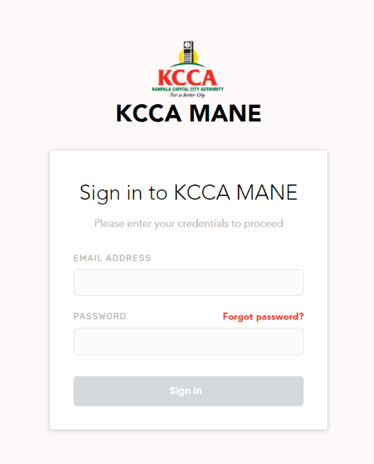
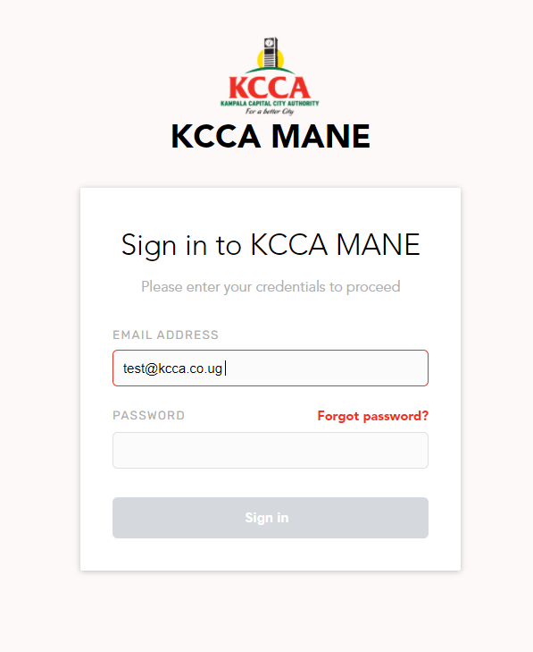
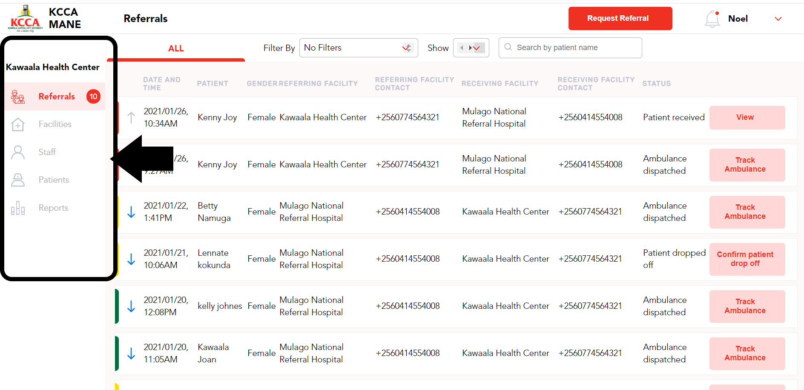

======================================================
KAMPALA EMERGENCY DIGITAL TRANSPORT SYSTEM
======================================================
HEALTH FACILITY USER GUIDE
---------------------------------
|
|
|
|
|
|
|
|

Prepared by: Outbox (U) Ltd

|
|
|
|
|
|
|

TABLE OF CONTENTS
-----------------
Introduction
****************
| 1.1 About the Kampala Emergency Digital Transport System
| 1.2 About this user guide
|     1.2.1 Manual Users
| 1.3  System requirements
| 1.4 Understand the typography

Getting Started
*******************
| 2.1 New User Login
      Health Facility Administrator
      Health Facility worker
      
| 2.2 Change password
| 2.3 Logout

3. EXPLORE SYSTEM FEATURES
******************************************************
| 3.1 Side Bar Menu
|     Referrals
|     Facilities
|     Staff
|     Patients	
|     Settings	
|     Reports
| 3.2 Referral Icons
|     Incoming Referral
|     Outgoing Referral
| 3.3 Referral color codes
| 3.4 Referral Statuses

4. GUIDING STEPS TO USE SYSTEM (HOW TO’S)
******************************************************
| Health facility Administrator
|     4.1  How to create user accounts for health facility workers
|     4.1 How to add health facility services
|     4.3 How to edit health facility worker accounts
| Health Facility worker (Referring facility)
|     4.4 How to request a referral at a referring facility
|     4.5 How to view referral information of an outgoing referral
|     4.6 How to track an Ambulance of an outgoing request
|     4.7 How to view ambulance handover report to receiving facility
|     4.8 How to view a patient report upon arrival at receiving facility
|     4.9 How to view patient outcome recorded at receiving facility
| Health facility worker (Receiving facility)
|     4.10 How to view incoming referral to receiving facility
|     4.11 How to view referral information of incoming referral to facility
|     4.12 How to track an ambulance of an incoming request
|     4.13 How to view ambulance hand over report at receiving facility
|     4.14 How to confirm patient receipt at receiving facility
|     4.15 How to record patient outcome at receiving facility

5.Troubleshooting
******************************************************
| 5.1 Issues with Signing  In
|     I forgot my password
|     I am unable to Sign In
| 5.2 The request referral button is not working
|     Referral button doesn’t turn red
|     Request referral fail
| 5.3 Issues with ICD 11 search
|     Error in ICD 11 search
|     ICD 11 search is not returning results

6. Getting additional help
******************************************************

1. INTRODUCTION
*****************************************
1.1 About the Kampala Emergency Digital Transport System
############################################################
The Kampala Emergency Digital Transport system was developed as part of a three year grant for the Kampala Slum Maternal and New-born Health (MaNe) project funded by USAID. The goal of the MaNe project is to generate evidence on effective and feasible interventions to improve Maternal and Newborn Health for the urban poor in Kampala. This 3-year USAID funded implementation research effort is testing innovative approaches to address the demand and supply-side barriers affecting care-seeking, effective referral and transport challenges and provision of quality care for urban poor. From the statistics of the KCCA 24-hour emergency call and dispatch centre between March and May 2020, up to 96% of the emergencies transported using the existing ambulance system were maternal and newborn health emergencies. The primary beneficiaries of this system are pregnant women and newborn babies although this system is designed to cater to all emergency referrals. From its inception, this system was created to achieve the following objectives;

- To map and connect all ambulances, public and private in Kampala, privately owned 
  vehicles for referral and linkage purpose
- To develop a functional triaging system that links patients in communities to 
  facilities and ambulances to enable patient transfer
- To capture data and generate reports for decision making in emergency maternal 
  referral services

The Kampala Emergency Digital Transport system has different interfaces namely: Call Centre interface, health facility interface and the ambulance application which all work concurrently. This user guide will focus on the usage of the call centre interface.  

1.2 About this user guide
###########################
This document will guide health facility administrators and workers on how to use the health facility interface of this Kampala Emergency Digital Transport system. 

1.2.1 Manual Users
+++++++++++++++++++

For effective usage of this user guide, you should start by understanding your user role here below: 

| **Health Facility Administrator**

The health facility administrators may include health facility incharges,health facility proprietors, health facility managers and any other individuals identified as the health facility administrator. The health facility administrator will manage and oversee the health facility resources in regards to this system.

| **Health Facility worker**

The health facility workers may include midwives and doctors. The health facility workers will majorly use the system to directly request and manage other duties to referrals.  

1.3  System requirements 
###########################
Please ensure that your computer or tablet meets the following minimum system requirements.

+----------------------------------------+---------------------------------------+
| Computer                               | Tablet                                |
+========================================+=======================================+
| Operating System: Windows 7 and Above  | Operating System: Android 7 and above |
+----------------------------------------+---------------------------------------+
| RAM: 8GB and above                     |    RAM: 2GB and above                 | 
+----------------------------------------+---------------------------------------+
| Browser: Google Chrome version 85 and  |     Storage: 32GB and above           |
| above or Firefox version 85 and above  |                                       |
|                                        |                                       |
+----------------------------------------+---------------------------------------+
| Connection: Stable internet connection |    Connection: 4G recommended         |
| through wifi or cable                  |                                       |
|                                        |                                       |
+----------------------------------------+---------------------------------------+
|                                        |     Form factor: Tablet               |
+----------------------------------------+---------------------------------------+

1.4 Understand the typography
############################################################
This document contains the following typographic conventions which will assist you to easily interpret the information in this manual.

| Italic text  identifies new terms

| **BOLD TEXT**  identifies a button or item that is clickable  and or actionable.

| Note   provides additional information about a given subject matter

2. GETTING STARTED
*****************************************
2.1 New User Login
############################################################

#. As a new user go to https://ambulances.kcca.go.ug/. 

| **Health Facility Administrator**

To use the system, you will need to SIGN IN using an email address and password provided to you by the KCCA call centre. 

| Note: The KCCA call centre is the central office that creates accounts for all health 
  facility administrators.

- Insert your email address and password and then the grey sign in button should turn to 
  red. 

- Click **SIGN IN**

| **Health Facility worker**

To use the system, you will need to **SIGN IN**  using an email address and password provided to you by your health facility administrator.

- Insert your email address and password and then the grey sign in button should turn to 
  red.  

- Click **SIGN IN**

2.2 Change password
############################################################

This will allow you to change your password.

- Click  this V arrow next to your name on the right upper corner of your screen. 

   .. image:: ./assets/healthUserGuideImages/image42.png
       :width: 1000px
       :align: center
       :height: 90px
       :alt: alternate text

- Click **CHANGE PASSWORD** in the drop down list.

   .. image:: ./assets/healthUserGuideImages/image44.png
       :width: 800px
       :align: center
       :height: 500px
       :alt: alternate text

- After clicking **CHANGE PASSWORD**, a pop up will appear as seen in the image below.

   .. image:: ./assets/healthUserGuideImages/image43.png
       :width: 800px
       :align: center
       :height: 500px
       :alt: alternate text

- Enter your old password and new password. Re-enter your new password for confirmation. 
- Then click **CHANGE PASSWORD** to save your new password.

2.3 Logout
############################################################

This will allow you to logout of the system.

- Click this V arrow next to your name on the right upper corner of your screen. 

   .. image:: ./assets/healthUserGuideImages/image42.png
       :width: 800px
       :align: center
       :height: 500px
       :alt: alternate text

- Click **LOGOUT**

   .. image:: ./assets/healthUserGuideImages/image44.png
       :width: 800px
       :align: center
       :height: 500px
       :alt: alternate text

3. EXPLORE SYSTEM FEATURES
*****************************************
3.1 Side Bar Menu 
############################################################
This is an interface on the left hand side of the screen that displays a list of the system tabs namely: Referrals, Facilities, Staff, Patients,Reports. If you are signed in as an administrator, you will view an additional settings tab in your sidebar menu.

      

Move your cursor and click each tab on the side menu bar to view the corresponding contents of each tab. Once you have clicked the respective tab, it will be highlighted in red. 

- Referrals
  
  This tab displays all the incoming and outgoing referrals at your facility. Under this 
  view, you will see the date and time of a given referral, patient name, gender, 
  referring facility name and contact, receiving facility name and contact, status of 
  requests and corresponding action buttons for each request.

   .. image:: ./assets/healthUserGuideImages/image45.png
       :width: 800px
       :align: center
       :height: 500px
       :alt: alternate text

- Facilities
  
  This tab displays a list of  health facilities added to the system. Under this view, 
  you will see the name of the health facility, level of the facility, phone contact of 
  the facility, facility address, clinician in charge, operating hours. Click view to 
  see additional details for each facility. 

   .. image:: ./assets/healthUserGuideImages/image46.png
       :width: 800px
       :align: center
       :height: 500px
       :alt: alternate text

- Staff
  
  This tab displays a list of healthcare staff added to the system. Under this view, you 
  will see the name of the staff individual, their contact,cadre and indication to show 
  if the staff worker is a specialist or not. 

   .. image:: ./assets/healthUserGuideImages/image48.png
       :width: 800px
       :align: center
       :height: 500px
       :alt: alternate text

- Patients
  
  This tab displays a list of all patients created at your facility. Under this view, 
  you will see the Date created, name of patient, gender, age, contact, Division, 
  Parish, Village,where patient was registered.Click view to see additional details for 
  each patient. 

   .. image:: ./assets/healthUserGuideImages/image49.png
       :width: 800px
       :align: center
       :height: 500px
       :alt: alternate text
 
- Settings
  
  This tab is only visible for health facility administrators. This tab enables health 
  facility administrators to add users,services and staff at the health facility. This 
  tab also enables the administrator to add, edit and update existing user information.

   .. image:: ./assets/healthUserGuideImages/image50.png
       :width: 800px
       :align: center
       :height: 500px
       :alt: alternate text

- Reports
  
  This tab shows a summary of the health facility progress and performance that will 
  enable appropriate analysis and practical recommendations. The report section enables 
  the user to access graphical representations of the key performance indicators of the 
  system.

3.2 Referral Icons
############################################################

| **Incoming Referral**

Incoming Referrals under the Referrals tab can be quickly be identified by this blue downward facing arrow 

   .. image:: ./assets/healthUserGuideImages/image4.png
       :width: 30px
       :align: center
       :height: 50px
       :alt: alternate text

| **Outgoing Referral**

Outgoing Referrals under the Referrals tab can be quickly be identified by this grey upward facing arrow

   .. image:: ./assets/healthUserGuideImages/image51.png
       :width: 30px
       :align: center
       :height: 50px
       :alt: alternate text

3.3 Referral color codes
############################################################
The following color codes appear to the left of each request to indicate the priority of this request.

+---------------------+-----------------------------------------------------------+
|                     |First  priority call is urgent  and requires immediate     |
|       red           | ambulance response                                        |
|                     |                                                           | 
+---------------------+-----------------------------------------------------------+
|                     |Second priority call is urgent but not life threatening.   |
|        green        |This call may not require immediate ambulance response     |
|                     |                                                           |
+---------------------+-----------------------------------------------------------+
|                     |Third priority call is not urgent and timeliness of        |
|          yellow     |ambulance response may not be required                     |
|                     |                                                           |
+---------------------+-----------------------------------------------------------+

3.4 Referral Statuses
############################################################
The following statuses will appear on the right of each request and update accordingly. 

+-----------------+---------------------------------------------------------------+
| Status          | Description                                                   |
+=================+===============================================================+
| New request     | When you have sent or received a new request, the status label|
|                 | will be New request with an action button to **View**         |
|                 | .. image:: ./images/image31.png                               |
|                 |      :width: 300px                                            |
|                 |      :align: center                                           |
|                 |      :height: 500px                                           |
|                 |      :alt: alternate text                                     |
|                 |                                                               |
+-----------------+---------------------------------------------------------------+
|Facility referred|When a receiving facility has been attached to a request at the|
|                 |call center, the status label will be **facility referred**    |
|                 |with an action button to view                                  | 
|                 | .. image:: ./images/image31.png                               |
|                 |      :width: 300px                                            |
|                 |      :align: center                                           |
|                 |      :height: 500px                                           |
|                 |      :alt: alternate text                                     |
|                 |                                                               |
+-----------------+---------------------------------------------------------------+
|Ambulance        |When an ambulance has been assigned and dispatched, the status |
|dispatched       |label will be **ambulance dispatched** with an action button to| 
|                 |**Track Ambulance**                                            |
|                 | .. image:: ./images/image31.png                               |
|                 |      :width: 300px                                            |
|                 |      :align: center                                           |
|                 |      :height: 500px                                           |
|                 |      :alt: alternate text                                     |
|                 |                                                               |
+-----------------+---------------------------------------------------------------+ 
|Ambulance to     |When the ambulance driver is on route to pick up patient, the  |
|scene            |status label will be ambulance to scene with an action button  | 
|                 |to **Track Ambulance**                                         |
|                 | .. image:: ./images/image31.png                               |
|                 |      :width: 300px                                            |
|                 |      :align: center                                           |
|                 |      :height: 500px                                           |
|                 |      :alt: alternate text                                     |
|                 |                                                               |
+-----------------+---------------------------------------------------------------+  
|Patient picked up|When the ambulance has picked up the patient, the status label |
|                 |will be patient picked up with an action button to **Track**   | 
|                 |**Ambulance**                                                  |
|                 | .. image:: ./images/image31.png                               |
|                 |      :width: 300px                                            |
|                 |      :align: center                                           |
|                 |      :height: 500px                                           |
|                 |      :alt: alternate text                                     |
|                 |                                                               |
+-----------------+---------------------------------------------------------------+   
|Patient dropped  |When the ambulance has dropped off patient at the receiving    |
|off              |facility, the status label will be patient dropped off with an |
|                 |action button to **View**                                      | 
|                 | .. image:: ./images/image31.png                               |
|                 |      :width: 300px                                            |
|                 |      :align: center                                           |
|                 |      :height: 500px                                           |
|                 |      :alt: alternate text                                     |
|                 |                                                               |
+-----------------+---------------------------------------------------------------+  
|Patient received |When the receiving facility confirms drop off of patient, the  |
|                 |status label will be patient received                          |
|                 | .. image:: ./images/image31.png                               |
|                 |      :width: 300px                                            |
|                 |      :align: center                                           |
|                 |      :height: 500px                                           |
|                 |      :alt: alternate text                                     |
|                 |                                                               |
+-----------------+---------------------------------------------------------------+  

4. GUIDING STEPS TO USE SYSTEM (HOW TO’S)
********************************************

| Health facility Administrator 

 4.1  How to create user accounts for health facility workers
#################################################################    

Ensure you are logged in as a Health facility admin. To create user accounts for your health facility workers that will use the system to refer patients, click the **SETTINGS** tab on the side menu bar. 

#. Under this settings bar, click **USERS** as indicated in the image below
            
   .. image:: ./images/image4.png
    :width: 300px
    :align: center
    :height: 500px
    :alt: alternate text

#. Click **ADD USER**
#. A pop up will appear as shown below 
            
   .. image:: ./images/image4.png
    :width: 300px
    :align: center
    :height: 500px
    :alt: alternate text

#. Fill the related information of the user 
#. Click **ADD USER**
                   
4.2 How to add health facility services
#################################################################      
Ensure you are logged in as a Health facility admin. To add the services that your health facility offers, click the settings tab on the side menu bar

#. Under this **SETTINGS**  tab, click health facility services
#. Click **ADD HEALTH FACILITY SERVICES**
#. A  pop up will appear
#. Fill the health facility services  information
#. Click add health facility services

4.3 How to add facility staff
#####################################
To add health facility staff employed at the health facility, click the settings tab on the side menu bar

#. Click **FACILITY STAFF** as indicated in the image below

   .. image:: ./images/image4.png
    :width: 300px
    :align: center
    :height: 500px
    :alt: alternate text

#. Click **FACILITY STAFF**
#. A pop up will appear as shown below 

   .. image:: ./images/image4.png
    :width: 300px
    :align: center
    :height: 500px
    :alt: alternate text

#. Fill the related information of the user 
#. Click **STAFF**

4.4 How to edit health facility worker accounts
#################################################
To edit the health facility worker details captured in 4.1. Click the settings tab on the side menu bar

#. Under this SETTINGS tab, click users 
#. Navigate to the health worker name
# Click the VIEW button on the right side of the given health worker ( Add image)
#. Click the edit button on the right side as shown below ( Add image)
#. Edit as required
#. Click add health facility staff

| Health Facility worker (Referring facility)

4.4 How to request a referral at a referring facility
#########################################################
#. To request a referral, click **REQUEST REFERRAL** on the Referrals page.

   .. image:: ./images/image4.png
    :width: 300px
    :align: center
    :height: 500px
    :alt: alternate text

#. A pop up will be appear as shown below

   .. image:: ./images/image4.png
    :width: 300px
    :align: center
    :height: 500px
    :alt: alternate text

#. Enter the information in the form above

- Search for the suggested receiving facility. Available options will be returned as you 
  type the suggested receiving facility

- Search for the specialist health worker on duty. Available options will be returned as 
  you type the name of specialist health worker on duty

- Search for the referring clinician. Available options will be returned as you type 
  your name.

- Check the checkbox of Has the specialist on duty been consulted if consulted.

- Enter Patient information

Tip: Ensure to click the create patient button as shown below for all new patients. Type full name of patient and thereafter click **CREATE PATIENT**.

.. image:: ./images/image4.png
    :width: 300px
    :align: center
    :height: 500px
    :alt: alternate text

- Search ICD 11 for the diagnosis of a patient. If the patient case is maternal related, 
  Click checkbox to restrict search to pregnancy complications. 

Tip: Enter 4letters in the ICD 11 search box and wait for search to return options and scroll in the drop down list. If available options are not suited, backspace entered text and use another search word

- Click the V arrow to access the drop down list for reasons for referral. Click the 
  appropriate reason for referral

- Enter Treatment given to the patient if any

- Enter the Investigations done at your facility

#. Click REQUEST REFERRAL. This button is at the bottom and will have turned from grey 
   to red if all the mandatory information is entered in the form.

#. You will receive a notification message to indicate that your referral request was 
   successfully sent to the KCCA Call centre to be acted on.

Note: All referrals created at your facility (outgoing) will appear under the referrals tab. Refer to 3.1 to understand more about this referrals tab. 

4.5 How to view referral information of an outgoing referral
##############################################################

To view and review the referral information you captured for a given referral:

#. Click the **REFERRALS** tab on the side menu bar

#. Search for the request or patient you would like to view in detail

#. Click **VIEW** on the right side of the status

#. You will be able to view all the related referral information you captured.

   .. image:: ./images/image4.png
    :width: 300px
    :align: center
    :height: 500px
    :alt: alternate text

Note: The given action buttons on the right side of the statuses update from time to time given the transition of your request. If view does not appear, you may still click on any of the action buttons on the right side to view the detailed referral information.

4.6 How to track an Ambulance of an outgoing request
############################################################

To track the assigned ambulance to a request, click on the Referrals tab.

#. Search for the patient you would like to track.

   .. image:: ./images/image4.png
    :width: 300px
    :align: center
    :height: 500px
    :alt: alternate text

#. Click **TRACK AMBULANCE** on the right side of the status

#. You will be able to view the ambulance progress as shown by the stepper in the image 
   below. You will be able to view the date and time when an ambulance was assigned, 
   when the dispatch was accepted, when ambulance is on route to pick up a patient, when 
   ambulance is at scene to pick up a patient and finally when the ambulance has dropped 
   off the patient. 

   .. image:: ./images/image4.png
    :width: 300px
    :align: center
    :height: 500px
    :alt: alternate text

#. Click **TRACK AMBULANCE**  on the top of your screen as shown below. You will be able 
   to view the physical location of the ambulance on the map.

   .. image:: ./images/image4.png
    :width: 300px
    :align: center
    :height: 500px
    :alt: alternate text

4.7 How to view ambulance handover report to receiving facility
##################################################################
To view the report sent by the ambulance driver.

#. Check the status of the request. If status is handover report sent, click VIEW on the 
   right side of the status

   .. image:: ./images/image4.png
    :width: 300px
    :align: center
    :height: 500px
    :alt: alternate text

#. Click **AMBULANCE** on the top of your screen as shown below to view this handover 
   report
   .. image:: ./images/image4.png
    :width: 300px
    :align: center
    :height: 500px
    :alt: alternate text

4.8 How to view a patient report upon arrival at receiving facility
#####################################################################

#. Check status of a given request. If the status is patient received. Click **view** on 
   the right side of the status

#. Click **RECEIVING FACILITY** on the top of your screen as shown below to view the 
   report recorded by the receiving facility upon receiving the patient.

   .. image:: ./images/image4.png
    :width: 300px
    :align: center
    :height: 500px
    :alt: alternate text

4.9 How to view patient outcome recorded at receiving facility
###################################################################

- Check status of a given request. If the status is patient received. Click VIEW on the 
  right side of the status

   .. image:: ./images/image4.png
    :width: 300px
    :align: center
    :height: 500px
    :alt: alternate text

- Click **DELIVERY REPORT** on the top of your screen as shown below to view this 
  report. 

   .. image:: ./images/image4.png
    :width: 300px
    :align: center
    :height: 500px
    :alt: alternate text

Note: This delivery report is updated by the receiving facility when the patient/mother has been attended to. Please note that the timeline for this delivery report varies and as of when the outcome of the patient is established, this report will be available. Hence this report may not be available immediately.

| Health facility worker (Receiving facility)

4.10 How to view incoming referral to receiving facility
##############################################################

#. An incoming referral to your health facility will appear under the referrals tab. 
   Please note that an incoming referral will have a blue downward arrow as seen in the 
   image below.

   .. image:: ./images/image4.png
    :width: 300px
    :align: center
    :height: 500px
    :alt: alternate text

#. Click **VIEW** on the right side of the status 
#. You will receive a notification message to indicate a new incoming referral request. 

Note: All referrals received at your facility (incoming) will appear under the referrals tab. Refer to 3.1 to understand more about this referrals tab. 

4.11 How to view referral information of incoming referral to facility
###########################################################################

To view and review the referral information for the incoming referral, Click the Referrals tab on the side menu bar.

#. Search for the request or patient you would like to view in detail
#. Click **VIEW** on the right side  of the status
#. You will be able to view all the related referral information captured for this 
   incoming referral as shown below. 

   .. image:: ./images/image4.png
    :width: 300px
    :align: center
    :height: 500px
    :alt: alternate text

Note: The given action buttons on the right side of the statuses update from time to time given the transition of your request. If view does not appear, you may still click on any of the action buttons on the right side to view the detailed referral information.

4.12 How to track an ambulance of an incoming request 
########################################################
To track the assigned ambulance to a request, click on the **REFERRALS** tab.

#. Search for the patient you would like to 

   .. image:: ./images/image4.png
    :width: 300px
    :align: center
    :height: 500px
    :alt: alternate text

#. Click **TRACK AMBULANCE** on the right side of the status

#. You will be able to view the ambulance progress as shown by the stepper in the image 
   below. You will be able to view the date and time when an ambulance was assigned, 
   when the dispatch was accepted, when ambulance is on route to pick up a patient, when 
   ambulance is at scene to pick up a patient and finally when the ambulance has dropped 
   off the patient. 

   .. image:: ./images/image4.png
    :width: 300px
    :align: center
    :height: 500px
    :alt: alternate text

#. Click **TRACK AMBULANCE**  on the top of your screen as shown below. You will be able 
   to view the physical location of the ambulance on the map.

   .. image:: ./images/image4.png
    :width: 300px
    :align: center
    :height: 500px
    :alt: alternate text

   .. image:: ./images/image4.png
    :width: 300px
    :align: center
    :height: 500px
    :alt: alternate text

4.13 How to view ambulance hand over report at receiving facility
######################################################################
To view the report sent by the ambulance driver.

#. Check the status of the request. If the status is handover report sent, click 
   **VIEW** on the right side of the status

   .. image:: ./images/image4.png
    :width: 300px
    :align: center
    :height: 500px
    :alt: alternate text

#. Click **AMBULANCE** on the top of your screen as shown below to view this handover 
   report 

   .. image:: ./images/image4.png
    :width: 300px
    :align: center
    :height: 500px
    :alt: alternate text

4.14 How to confirm patient receipt at receiving facility 
##########################################################
To confirm that the patient is received at the receiving facility

#. Check the status of request. If status is patient dropped off, click **CONFIRM 
   PATIENT DROP OFF** on the right side of the status

   .. image:: ./images/image4.png
    :width: 300px
    :align: center
    :height: 500px
    :alt: alternate text

#. Click **CONFIRM PATIENT RECEIPT** on the top of your screen as shown below.

   .. image:: ./images/image4.png
    :width: 300px
    :align: center
    :height: 500px
    :alt: alternate text

#. A pop up will be appear as shown below

   .. image:: ./images/image4.png
    :width: 300px
    :align: center
    :height: 500px
    :alt: alternate text

#. Enter the information in the form above
#. Click **CONFIRM PATIENT DROP OFF**. This button is at the bottom and will have turned 
   from grey to red if all the mandatory information is entered in the form. 

4.15 How to record patient outcome at receiving facility 
##########################################################
To report and record the outcome of a patient. click on the Referrals tab.

#. Search for the patient and click **VIEW** on the right side of the status
#. **Click DELIVERY REPORT** on the top of your screen as shown below 

   .. image:: ./images/image4.png
    :width: 300px
    :align: center
    :height: 500px
    :alt: alternate text

#. A pop up will appear as shown below 
   .. image:: ./images/image4.png
    :width: 300px
    :align: center
    :height: 500px
    :alt: alternate text

#. Fill all the related information  and click SUBMIT REPORT

   .. image:: ./images/image4.png
    :width: 300px
    :align: center
    :height: 500px
    :alt: alternate text

5.TROUBLESHOOTING
********************************************
5.1 Issues with Signing  In
##################################

| **I forgot my password**

- In case you **forget your password**.Type your email address and tap on the **FORGOT 
  PASSWORD**? link to reset your password and follow the instructions given.

- If you are still unable to change your password, contact your administrator

   .. image:: ./images/image4.png
    :width: 300px
    :align: center
    :height: 500px
    :alt: alternate text

| **I am unable to Sign In**

- In case you are unable to login into the interface, Check to see if your email address 
  entered is correct. This is the email address that was used when creating your 
  account.

- Check to see if the password entered is correct. This is the password that was created 
  for you or the password that you have changed to.

If all the above is correct, Click **Sign In**

- In case you are still unable to sign in when your email address and password are 
  correct 

|    Check to see if your internet connection is on. 
|    If you are not connected to the internet, connect and try signing in.
|    If you are connected and you are unable to sign in, refresh the page and sign in. 
     To refresh the page click on the refresh icon in the top left hand of your browser.

        .. image:: ./images/image4.png
            :width: 300px
            :align: center
            :height: 500px
            :alt: alternate text

       This is the refresh icon.

|    If all these fail, contact your supervisor or super administrator.

5.2 The request referral button is not working
######################################################
Referral button doesn’t turn red

- If the referral button doesn't turn red, check to see if you have filled all mandatory  
  information in the pop up referral form. Refer to section 4.4 for details on 
  information to fill in the pop up form.

Request referral fail

- Again, check to ensure that you have filled all the related information in the pop up 
  form displayed
- Check to see if your internet connection is on. 

5.3 Issues with ICD 11 search
#####################################
**Error in ICD 11 search**

   .. image:: ./images/image4.png
    :width: 300px
    :align: center
    :height: 500px
    :alt: alternate text

- Ensure that you have a good internet connection

| **ICD 11 search is not returning results**

- Restrict search for pregnancy related cases to enable search optimization
- Ensure that you have a good internet connection

6. GETTING ADDITIONAL HELP
***********************************
-  To receive technical support and software assistance, please contact the **KCCA** 
   call 
   centre